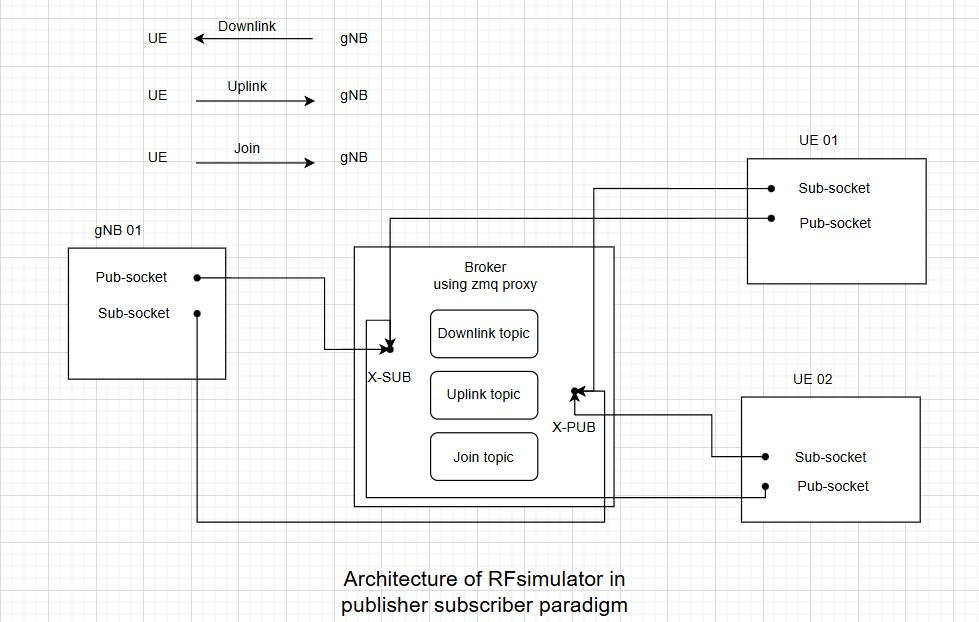

# Overview :

The original implementation of the RF simulator has certain limitations, particularly with regard to sidelink and mobility features. This is due to its client-server architecture, which was implemented using BSD sockets. To overcome these constraints, we transitioned to a publisher-subscriber paradigm using the ZMQ library. This new approach enhances scalability, enabling support for a larger number of devices.  
# Architecture :

The main components in the new architecture are:
**Broker**: The broker is built using XSUB and XPUB sockets, and the [zmq_proxy](http://api.zeromq.org/4-2:zmq-proxy) function to route traffic between the two sockets.

The gNB and the UE both have 2 sockets, a subscriber socket that connects to XPUB socket of the broker and a publisher socket that connects to XSUB socket of the broker.

**UE**: Subscribes to **downlink** topic.  
**gNB**: Subscribes to **uplink** topic, and **join** topic to detect connections from UEs.

See the following diagram:


# Build :

NB : If you want to test with higher number of UEs than 16 UEs,  In `<path to oai sources>/openairinterface5g/common/openairinterface5g_limits.h`
Set MAX_MOBILES_PER_GNB to 64 

```
# define MAX_MOBILES_PER_GNB 64
```

## Using build_oai 

It's possible to build the rfsimulator device in its traditional implementation, whether by itself or with the OAI gNb or OAI UE

```
cd <path to oai sources>/openairinterface5g/cmake_targets

./build_oai --gNB --nrUE -w SIMU
```

to build the publisher-subscriber version you need to add "--zmq" option, 
```
./build_oai --gNB --nrUE --zmq
```
to rebuild the rfsimulator only:
```
./build_oai -w SIMU --zmq
```
# Usage :

Similar to the client-server rfsimulator, you can run the UEs and gNB. However, in the publisher-subscriber version, you must launch the broker first.
## Launch the broker :

```
cd openairinterface5g/cmake_targets/ran_build/build
./broker
```
## Launch the gNB : 

```
sudo ./nr-softmodem -O ../../../targets/PROJECTS/GENERIC-NR-5GC/CONF/gnb.sa.band77.fr1.273PRB.usrpx300.conf --gNBs.[0].min_rxtxtime 6 --rfsim
``` 

## Launch multiple UEs :

refer to https://gitlab.eurecom.fr/oai/openairinterface5g/-/blob/develop/doc/NR_SA_Tutorial_OAI_multi_UE.md for detailed instructions.

For each UE specify its device-id as well as the accessible broker-ip from its namespace. 

Example : to launch the device x 

```
~/multi-ue.sh -c x
~/multi-ue.sh -o x
```

```
cd openairinterface5g/cmake_targets/ran_build/build

sudo ./nr-uesoftmodem -r 106 --numerology 1 --band 78 -C 3619200000 --uicc0.imsi 00101000000000x --rfsim --device_id id --brokerip 10.20x.1.100

```
Make sure that the device_id for each UE running is different.

# Test Automation : 

You can use the following script to automatically launch a large number of UEs and monitor the gNB logs as they attach.
Before running the script, make sure to start the core network and the broker. Then, execute the following command:
```
sudo <path to oai sources>/tools/scripts/test_automation.sh --nb-ue 40

```
You can find all the logs in `<path to oai sources>/logs`.


# TODO:
- Handle connection teardown.
- Make memory management more efficient.
- Add more features to the broker.


